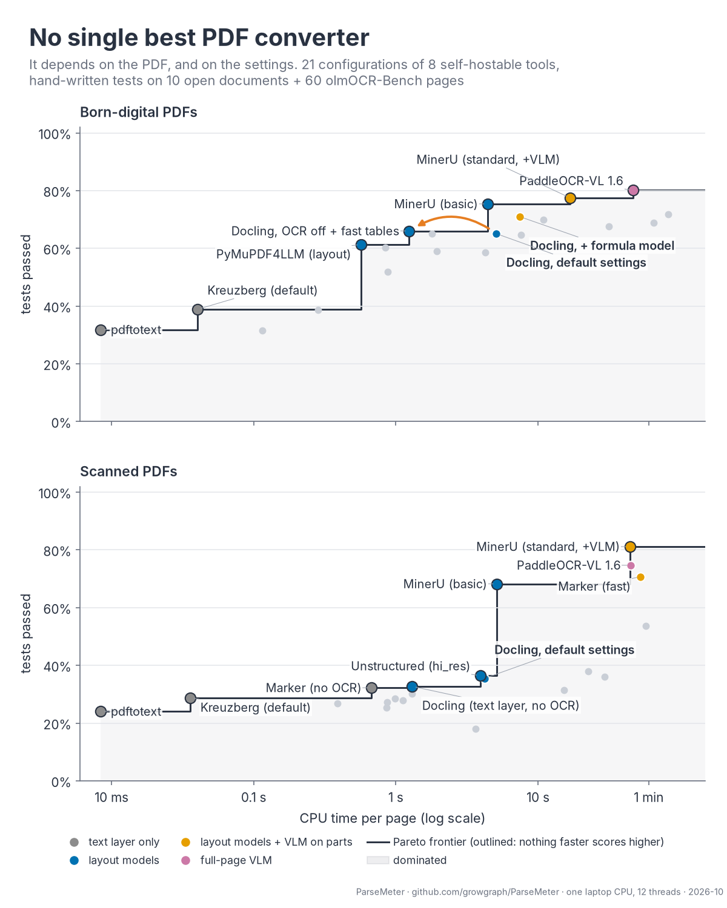

# ParseMeter

Benchmarks for PDF-to-text converters, measured on what a downstream knowledge-graph or RAG
pipeline needs from the text: page furniture removed, sentences stitched across page breaks,
reading order, footnotes, tables, equations, sub/superscripts, headings, figures and
characters — on born-digital and on scanned documents, with time per page on a CPU.

Each converter is run in one or more named configurations ("arms"); most tools have many
settings that move quality, so a result belongs to a tool *and* its configuration.

## What is measured

| | |
|---|---|
| **Probes** | 569 hand-written tests over 12 documents (`probes/src/<doc>.py`), authored from the page images. They use olmOCR-Bench's test types (`present`, `absent`, `order`, `table`, `math`) plus `heading`, `figure` and regex probes, and run on the whole-document markdown, so page stitching is testable. |
| **olmOCR-Bench slice** | 150 one-page PDFs (25 per category) from [olmOCR-Bench](https://huggingface.co/datasets/allenai/olmOCR-bench) at a pinned revision, scored with its own test classes. |
| **Regimes** | Every document is classified from the file (`bench/study/regime.py`): `digital` (real text layer), `scan_ocr` (page image with a hidden OCR layer), `scan` (no text layer). Results are reported per regime. |
| **Time** | Wall seconds per page, CPU only, one arm at a time. |
| **Representation** | What each converter's native output keeps as typed structure beyond the markdown: [docs/representation.md](docs/representation.md). |

The landscape of tools, licences and published scores is in [docs/landscape.md](docs/landscape.md);
how our numbers line up with published ones is in [docs/published-comparison.md](docs/published-comparison.md).

## Corpus

`sources.yaml` lists every document with origin, licence, `excerpt_ok` and sha256.

| Group | Documents |
|---|---|
| papers | Nat. Commun. 2020 (CC BY); three arXiv papers (CC BY): tables + equations, ~68 equations + footnotes, 11 results tables; PLOS ONE 2026 (CC BY) with table footnotes |
| reports | CRS report R47872 (US government, ~80 footnotes); Apple 10-K FY2025, Apple 10-Q Q3 FY2026, Stitch Fix 10-K FY2026 (public SEC filings) |
| scanned | NACA RM E7B11c (1947, typewritten, no text layer), Bureau of Standards RP1 (1928, hidden OCR layer), USGS Bulletin 580-J (1915, hidden OCR layer) — US government works; provenance in [docs/scanned-sources.md](docs/scanned-sources.md) |

The **core set** — all documents except the two 10-Ks, plus the first 10 olmOCR-Bench PDFs
per category — is what slow arms run on and what like-for-like comparisons use.

## Arms

| Arm | Configurations | Notes |
|---|---|---|
| `pdftotext` | — | poppler, text layer only |
| `docling` | `default`; one-setting departures `noocr`, `fast`, `layoutonly`, `native`, `fullocr`, `formula`; `lean` (`fast` + formula); `textlayer`, `tuned` (+ `granite`, `glmocr`, `lightonocr`) | Docling 2.132, [arms/docling](arms/docling/README.md) |
| `mineru` | `basic`, `standard` | MinerU 4.0.10, [arms/mineru](arms/mineru/README.md) |
| `marker` | `nocr`, `fast` (+ `balanced`) | Marker 2.0.0, [arms/marker](arms/marker/README.md) |
| `paddle` | `structurev3`, `vl` | PaddleOCR 3.7, [arms/paddle](arms/paddle/README.md) |
| `pymupdf4llm` | `default`, `layout` | [arms/pymupdf4llm](arms/pymupdf4llm/README.md) |
| `kreuzberg` | `default` | [arms/kreuzberg](arms/kreuzberg/README.md) |
| `unstructured` | `hires` | [arms/unstructured](arms/unstructured/README.md) |
| `grobid` | `default` | docker, [arms/grobid](arms/grobid/README.md) |

Configurations in parentheses are built but were not part of the published run (CPU cost).

## Results (2026-10-03)

One 6-core/12-thread laptop CPU, no GPU; versions in each `out/<arm>/env.json`. Core set, every
arm complete (10 of our documents + 60 olmOCR-Bench pages); probes are macro means over
categories; regime columns are the share of all tests passed on pages of that regime. Full
tables: `out/summary/` (`core_*`, `digital_probes`).

| Arm | Probes | olmOCR slice | Born-digital | Scan + OCR layer | Scan, no text | s/page |
|---|---|---|---|---|---|---|
| MinerU `standard` | **0.82** | 0.76 | 0.78 | **0.86** | 0.71 | 25 |
| PaddleOCR-VL 1.6 (`paddle:vl`) | 0.78 | **0.80** | **0.80** | 0.82 | 0.60 | 46 |
| Marker `fast` | 0.73 | 0.65 | 0.68 | 0.67 | **0.79** | 38 |
| MinerU `basic` | 0.71 | 0.75 | 0.75 | 0.77 | 0.50 | 4.6 |
| Docling `formula` | 0.65 | 0.48 | 0.70 | 0.41 | 0.25 | 16 |
| PP-StructureV3 (`paddle:structurev3`) | 0.65 | 0.68 | 0.72 | 0.58 | 0.45 | 75 |
| Docling `tuned` | 0.65 | 0.49 | 0.69 | 0.41 | 0.31 | 53 |
| Docling `lean` | 0.62 | 0.48 | 0.71 | 0.42 | 0.11 | 9.8 |
| Docling `default` | 0.61 | 0.46 | 0.65 | 0.41 | 0.24 | 4.8 |
| Marker `nocr` | 0.57 | 0.43 | 0.60 | 0.47 | 0.02 | 0.8 |
| Docling `fast` | 0.55 | 0.45 | 0.66 | 0.42 | 0.02 | 1.2 |
| Unstructured `hires` | 0.55 | 0.40 | 0.59 | 0.42 | 0.25 | 4.2 |
| PyMuPDF4LLM `layout` | 0.54 | 0.33 | 0.61 | 0.35 | 0.21 | 0.8 |
| Kreuzberg | 0.40 | 0.31 | 0.39 | 0.42 | 0.02 | <0.1 |
| pdftotext | 0.31 | 0.26 | 0.32 | 0.35 | 0.01 | <0.1 |

Other Docling configurations are in `out/summary/` and `figures/docling_settings.png`.
On the nine born-digital documents alone (`digital_probes`, the 10-Ks included), Docling
`lean` leads at 0.84 and 3.2 s/page, then Docling `tuned` 0.83 (31 s/page), Marker `fast` 0.78,
and Docling `default`/`fast` and MinerU `basic` at 0.76; the VLM arms that ran on the core set
only are not in that table.



Figures (`figures/`):
- `hero`: the one-image summary;
- `frontier_overall`, `frontier_regimes`, `frontier_by_metric`: quality against time, with the
  Pareto frontier marked;
- `metric_heatmap`: every arm × metric;
- `settings_spread` and `docling_settings`: the same tool in different configurations;
- `representation`: what each native output keeps typed.

On the olmOCR-Bench slice the harness reproduces published runs: within 1.5 points for Marker
(no OCR), Docling (defaults) and the MinerU pipeline, and inside our 95% intervals for the VLM
arms ([docs/published-comparison.md](docs/published-comparison.md)).

Timings come from the runs themselves, one arm at a time; a dedicated quiet timing pass is
pending.

## Layout

| Path | What it is |
|---|---|
| `corpus/<group>/<id>.pdf` | The documents |
| `probes/src/<doc>.py` → `probes/<doc>.jsonl` | Probes per document |
| `arms/<arm>/` | One uv project per converter: `run.py` exposes `make(variant) -> convert(pdf, assets) -> markdown` |
| `arms/_driver.py` | Stdlib-only driver run inside each arm's environment; resumable; writes `out/<arm>-<variant>/` |
| `run_queue.sh`, `run_benchmark.sh` | Run arms one after another; the measurement as published |
| `bench/` | Scoring: `study.{olmocr_slice, doclist, regime, author, probes, score, check, subset, completeness, aggregate, figures, published, export}` |
| `out/<arm>-<variant>/` | Markdown per document, `timing.jsonl`, `env.json` (versions) |
| `out/scores/`, `out/summary/` | Per-test results; summary tables (`core_*` = like for like) |
| `figures/` | Trade-off figures |

## Reproduce

```bash
cd bench && uv sync && uv run playwright install chromium
PYTHONPATH=. uv run python -m study.olmocr_slice     # olmOCR-Bench slice -> data/olmocr
PYTHONPATH=. uv run python -m study.doclist          # out/doclist.json (with regimes)
PYTHONPATH=. uv run python -m study.author           # probes/src/*.py -> probes/*.jsonl
PYTHONPATH=. uv run pytest                           # the scorer on hand-made markdown
cd ..
bash arms/fetch_llama.sh                             # llama.cpp CPU build for marker and paddle
for a in arms/*/; do (cd $a && uv sync); done        # one environment per arm; see each README
./run_benchmark.sh all                               # hours to days on a laptop CPU; resumable
cd bench
TQDM_DISABLE=1 PYTHONPATH=. uv run python -m study.score
PYTHONPATH=. uv run python -m study.aggregate        # out/summary/*.csv + digest.md
PYTHONPATH=. uv run python -m study.figures          # figures/
PYTHONPATH=. uv run python -m study.published        # out/summary/published_vs_ours.csv
PYTHONPATH=. uv run python -m study.check <doc>      # one document's probes across arms
PYTHONPATH=. uv run python -m study.subset --covered-by A,B   # all arms on the pages A and B both converted
```

A probe failing on every arm is suspect: read it against the page before trusting it.

## Licences

Code: Apache-2.0 ([LICENSE](LICENSE)). Documents keep their own licences (`sources.yaml`):
CC BY 4.0 papers, US-government works, and public SEC filings. The olmOCR-Bench slice is
ODC-BY and is downloaded, not redistributed. Converter licences — including model weights,
which differ from code for several tools — are summarised in
[docs/landscape.md](docs/landscape.md).
